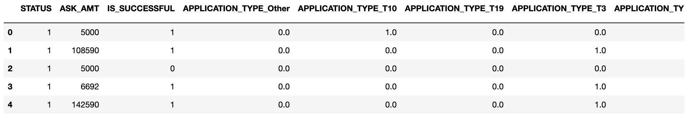

# Neural_Network_Charity_Analysis
## Purpose 
- Using my knowledge of neural networks, I used the charity data CSV file from Alphabet Soup in order to create a binary classifier capable of predicting whether applicants will be successful if funded by Alphabet Soup.

## Results 
### Deliverable 1: Preprocessing Data for a Neural Netowrk Model 
- For Deliverable 1, I preprocessed the dataset in order to compile train, and evaulate the neural netowrk mode used later in the analysis.
  - The variable considered to be the target is the "IS_SUCCESSFUL" columns
  - Variables that can be considered for the model are "APPLICATION_TYPE" as well as the "INCOME_AMT" columns.
  - The cariables that are not considered targets nor features are the "EIN" and "NAME" columns since they do not add anything to our analysis. They were removed during    the preprocessing portion of this analysis.
  
#### Deliverable 1 Merged DataFrame

### Deliverable 2: Compile, Train, and Evaluate the Model
- Using my knowledge of Tensorflow, I designed a deep learning model to create a binary classification model that can predict if an Alphabet SOup-funded organization will be sucessful based on the features in the dataset used previously.
  - For my model, I had two 

## Summary 

## Resources
